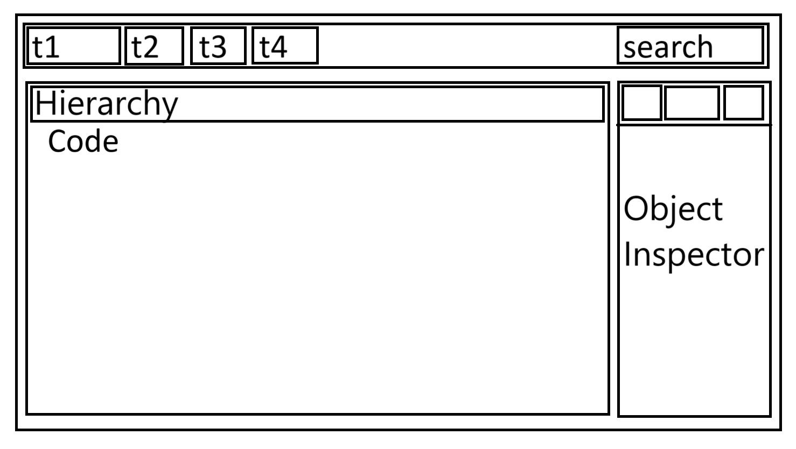

# Main design

The page will be separated into three different parts:

1. **Header**
2. **Main Content**
3. **Object Inspector**

## Header
The header will contain the title of the page and the navigation bar.
The navigation bar will contain a search bar to search for a specific object/field in the trace.
Moreover, the navigation bar will contain some buttons to interact with the trace.

## Main Content
The main content will contain the source code of the trace.

## Object Inspector
The object inspector will contain the information of the selected object in the trace.
